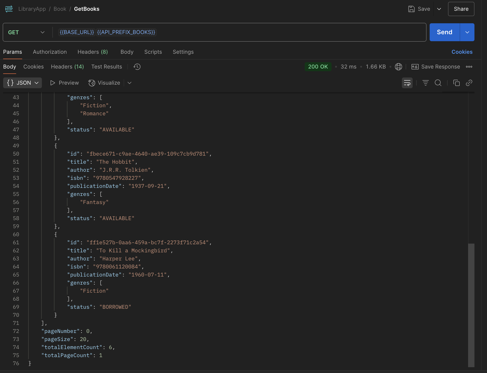
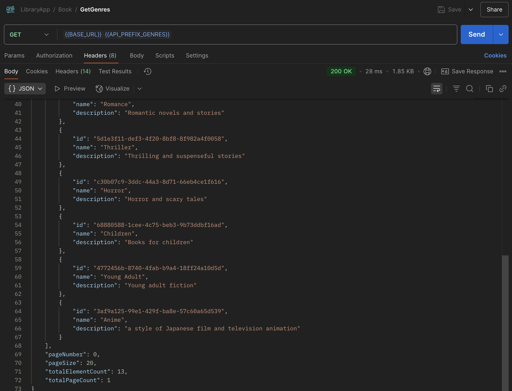

# Library App

## 📖 Information

**Authentication:**

All users must register before accessing book borrowing, returning, or administrative endpoints. Upon successful login, the system issues an access token and a refresh token using JWT. A dedicated endpoint is provided to refresh tokens when the access token expires. Logging out will invalidate the refresh token, effectively terminating the session. Role-based access is enforced through Spring Security, ensuring that sensitive operations are restricted to authorized roles. The system responds with appropriate HTTP status codes: 200 for successful operations, 400 for invalid input, 401 for unauthorized access, and 409 for resource conflicts such as duplicate entries.

**Book Management:**

Librarians are responsible for adding new books to the system. Each book entry includes details such as the title, author, ISBN, publication date, and genre. All inputs are validated before persistence to ensure data integrity. Both librarians and patrons can view detailed information about books and perform searches using filters like title, author, ISBN, or genre. All search operations support pagination to handle large result sets efficiently. Book updates and deletions are restricted to librarian users. Duplicate ISBNs are not allowed and will result in a 409 Conflict.

**User Management:**

The system allows users to register by submitting personal information including name and contact details. Upon registration, each user is assigned a role: either PATRON or LIBRARIAN. Librarians have elevated permissions, which include viewing, updating, and deleting other users’ profiles. Role-based access controls ensure that patrons cannot perform administrative operations. Authentication is mandatory for all protected resources, and access rights are evaluated using JWT tokens.

**Borrowing and Returning:** 

Patrons can borrow available books, with the system recording both the borrowing date and the due date. Before completing the borrowing operation, the system validates that the book is available and that the patron is eligible to borrow more books. Returning a book updates the system to reflect the book’s availability and closes the borrowing record. Users can view their personal borrowing history at any time, while librarians have the ability to access the full borrowing history of all users. The system also tracks overdue books and allows librarians to generate detailed reports for follow-up actions.


### Technologies

---
- Java 21
- Spring Boot 3.0
- Open Api (Swagger)
- Maven
- Docker
- Postman
- PostgreSQL
- Prometheus
- Grafana
- Kubernetes
- JaCoCo (Test Report)


### Rest APIs
---
<table style="width:100%;">
  <tr>
    <th>Method</th>
    <th>URL</th>
    <th>Description</th>
  </tr>

  <!-- ─────── AUTH ─────── -->
  <tr>
    <td>POST</td>
    <td>/api/v1/auth/register</td>
    <td>Register a new user</td>
  </tr>
  <tr>
    <td>POST</td>
    <td>/api/v1/auth/login</td>
    <td>User login</td>
  </tr>
  <tr>
    <td>POST</td>
    <td>/api/v1/auth/refresh-token</td>
    <td>Refresh access token</td>
  </tr>
  <tr>
    <td>POST</td>
    <td>/api/v1/auth/logout</td>
    <td>Invalidate refresh token (logout)</td>
  </tr>

  <!-- ─────── USERS ─────── -->
  <tr>
    <td>GET</td>
    <td>/api/v1/users/{id}</td>
    <td>Get user details</td>
  </tr>
  <tr>
    <td>GET</td>
    <td>/api/v1/users</td>
    <td>List users (paginated)</td>
  </tr>
  <tr>
    <td>PUT</td>
    <td>/api/v1/users/{id}</td>
    <td>Update user</td>
  </tr>
  <tr>
    <td>PUT</td>
    <td>/api/v1/users/{id}/soft-delete</td>
    <td>Soft-delete user</td>
  </tr>

  <!-- ─────── BOOKS ─────── -->
  <tr>
    <td>POST</td>
    <td>/api/v1/books</td>
    <td>Add a new book</td>
  </tr>
  <tr>
    <td>GET</td>
    <td>/api/v1/books/{id}</td>
    <td>Get book by ID</td>
  </tr>
  <tr>
    <td>GET</td>
    <td>/api/v1/books</td>
    <td>Search books (paginated)</td>
  </tr>
  <tr>
    <td>PUT</td>
    <td>/api/v1/books/{id}</td>
    <td>Update book</td>
  </tr>
  <tr>
    <td>PUT</td>
    <td>/api/v1/books/{id}/soft-delete</td>
    <td>Soft-delete book</td>
  </tr>
  <tr>
    <td>GET</td>
    <td>/api/v1/books/availability/stream</td>
    <td>Stream availability events (SSE)</td>
  </tr>

  <!-- ─────── GENRES ─────── -->
  <tr>
    <td>POST</td>
    <td>/api/v1/genres</td>
    <td>Create genre</td>
  </tr>
  <tr>
    <td>GET</td>
    <td>/api/v1/genres/{id}</td>
    <td>Get genre by ID</td>
  </tr>
  <tr>
    <td>GET</td>
    <td>/api/v1/genres</td>
    <td>List genres (paginated)</td>
  </tr>
  <tr>
    <td>PUT</td>
    <td>/api/v1/genres/{id}</td>
    <td>Update genre</td>
  </tr>
  <tr>
    <td>DELETE</td>
    <td>/api/v1/genres/{id}</td>
    <td>Delete genre</td>
  </tr>

  <!-- ─────── BORROWINGS ─────── -->
  <tr>
    <td>POST</td>
    <td>/api/v1/borrowings</td>
    <td>Borrow a book</td>
  </tr>
  <tr>
    <td>PUT</td>
    <td>/api/v1/borrowings/{id}/return</td>
    <td>Return a book</td>
  </tr>
  <tr>
    <td>GET</td>
    <td>/api/v1/borrowings</td>
    <td>List borrowings (paginated + filters)</td>
  </tr>
  <tr>
    <td>GET</td>
    <td>/api/v1/borrowings/overdue</td>
    <td>Download overdue borrowings PDF</td>
  </tr>
</table>

### Open Api (Swagger)

```
http://localhost:8080/swagger-ui/index.html
```
---
### Database Schema
<p align="center">
    
</p>


### Prerequisites

#### Define Variable in .env file

```
url: ${SPRING_DATASOURCE_URL}
username: ${DATABASE_USERNAME}
password: ${DATABASE_PASSWORD}
```

### Maven Run
To build and run the application with `Maven`, please follow the directions shown below;

```sh
$ cd libraryapp
$ mvn clean install
$ mvn spring-boot:run
```

---
### Docker Run
The application can be built and run by the `Docker` engine. The `Dockerfile` has multistage build, so you do not need to build and run separately.

Please follow directions shown below in order to build and run the application with Docker Compose file;

```sh
$ cd libraryapp
$ docker-compose up -d
```

If you change anything in the project and run it on Docker, you can also use this command shown below

```sh
$ cd libraryapp
$ docker-compose up --build
```

To monitor the application, you can use the following tools:

- **Prometheus**:  
  Open in your browser at [http://localhost:9090](http://localhost:9090)  
  Prometheus collects and stores application metrics.

- **Grafana**:  
  Open in your browser at [http://localhost:3000](http://localhost:3000)  
  Grafana provides a dashboard for visualizing the metrics.  
  **Default credentials**:
    - Username: `admin`
    - Password: `admin123!`

 ### Kubernetes Run
To run the application, please follow the directions shown below;

- Start Minikube

```sh
$ minikube start
```

- Open Minikube Dashboard

```sh
$ minikube dashboard
```

- To deploy the application on Kubernetes, apply the Kubernetes configuration file underneath k8s folder

```sh
$ kubectl apply -f k8s
```

- To open Prometheus, click tunnel url link provided by the command shown below to reach out Prometheus

```sh
minikube service prometheus-service
```

- To open Grafana, click tunnel url link provided by the command shown below to reach out Prometheus

```sh
minikube service grafana-service
```

### ### JaCoCo (Test Report)
---

After running mvn clean install, JaCoCo generates an HTML coverage report at:
```
target/site/jacoco/index.html
```
	1.Open a file explorer or terminal and navigate to target/site/jacoco/.
	2.Launch index.html in your web browser.

 You’ll see a detailed breakdown of line, branch, and method coverage for every module and class in the project.
<p align="center">
    
</p>
---

### API Request Samples (Postman)
#### Borrow Book
// explain with english 
<p align="center">
  
</p>

#### CreateBook
<p align="center">
  
</p>

#### Borrow Book  
Allows a user to borrow a book by providing the book ID and user credentials.  

<p align="center">
  
</p>

#### Create Book  
Used by librarians to add a new book to the system with details like title, author, and ISBN.  

<p align="center">
  
</p>

#### Create Genre  
Allows a librarian to create a new genre category for books.  

<p align="center">
  
</p>

#### Delete Genre  
Removes a genre from the system. Only accessible by librarian roles.  

<p align="center">
  
</p>

#### Delete User  
Soft-deletes a user account. Typically used by librarians.  

<p align="center">
  
</p>

#### Get Book  
Retrieves detailed information about a specific book by its ID.  

<p align="center">
  
</p>

#### Get Books  
Fetches a paginated list of books with optional filters like title, genre, or author.  

<p align="center">
  
</p>

#### Get Borrowing  
Fetches borrowing details for a specific record.  

<p align="center">
  
</p>

#### Get Genre  
Fetches details of a specific genre by ID.  

<p align="center">
  
</p>

#### Get Genres  
Returns a list of all genres with pagination support.  

<p align="center">
  
</p>

#### Get User  
Retrieves a user's details by their ID.  

<p align="center">
  
</p>

#### Get Users  
Returns a paginated list of users in the system.  

<p align="center">
  
</p>

#### Login  
Authenticates a user and returns JWT access and refresh tokens.  

<p align="center">
  
</p>

#### Logout  
Invalidates the user's refresh token to log them out.  

<p align="center">
  
</p>

#### Refresh Token  
Issues a new access token using a valid refresh token.  

<p align="center">
  
</p>

#### Return Book  
Marks a borrowed book as returned and updates availability.  

<p align="center">
  
</p>

#### Stream 1  
Streams book availability updates via Server-Sent Events (SSE).  

<p align="center">
  
</p>

#### Stream 2  
Alternative view for streaming real-time book availability.  

<p align="center">
  
</p>

#### Update Book  
Updates an existing book's details. Only librarians can perform this.  

<p align="center">
  
</p>

#### Update Genre  
Modifies an existing genre’s name or attributes.  

<p align="center">
  
</p>

#### Update User  
Used to update user profile information such as name or contact.  

<p align="center">
  
</p>


#### Overdue Borrowings  
PDF report of overdue borrowings, accessible by librarians.  

<p align="center">
  
</p>

#### Grafana Dashboard  
Shows application metrics visualized via Grafana dashboards.  

<p align="center">
  
</p>
